# Praktikum 7

## Profil
| | Biodata |
| -------- | --- |
| **Nama** | Rangga Saputra |
| **NIM** | 312010266 |
| **Kelas** | TI.20.A2 |
| **Mata Kuliah** | Pemrograman Web |

## 1. Install XAMPP

Download XAMPP pada situs resminya, lalu ekstrak file dan simpan directory yang diinginkan
Disini saya menyimpan pada OS(C:)

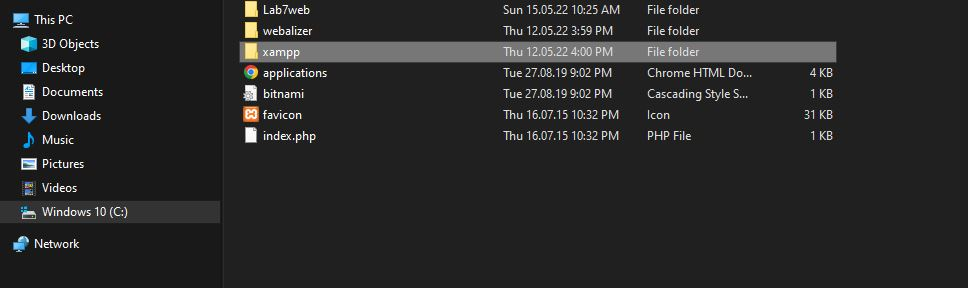

## 2. Install XAMPP

Tekan tombol **start** pada action **apache** seperti gambar dibawah.
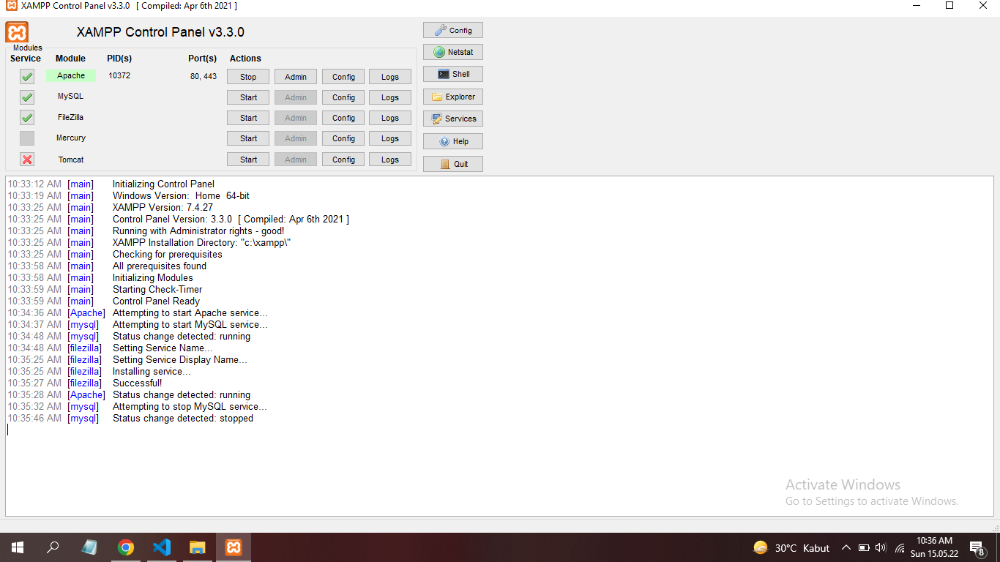

## 3 Memulai PHP
Buat folder `lab7_php_dasar` pada (C:\xampp\htdocs) seperti gambar dibawah.
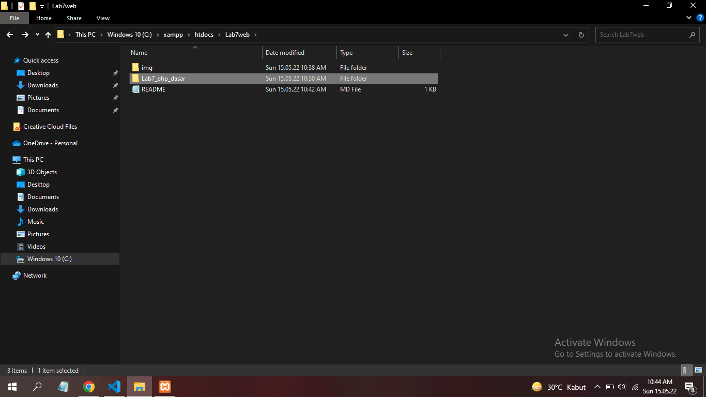

Kemudian untuk mengakses direktory tersebut pada web server dengan mengakses URL: 
http://localhost/lab7web/lab7_php_dasar/

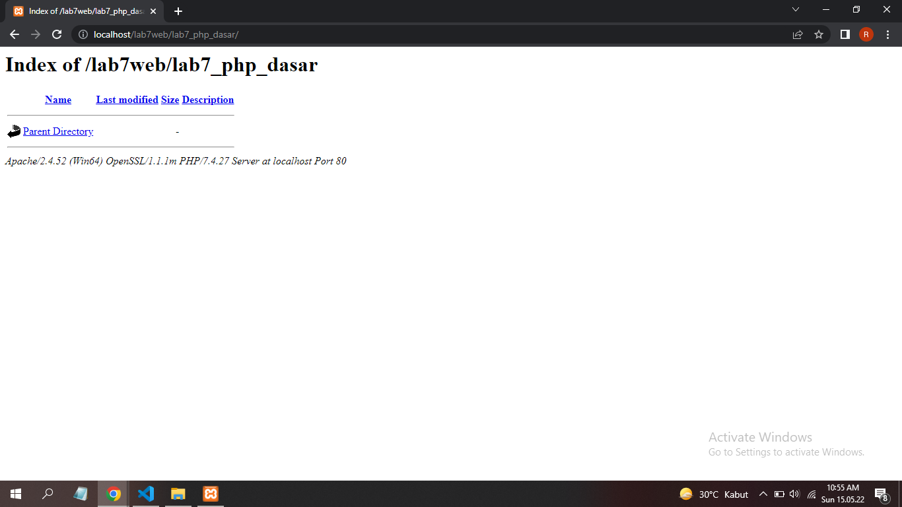

## 4. PHP dasar

Buat file baru dengan nama **php_dasar.php** pada directory tersebut. Kemudian buat kode seperti berikut.
```html
<!DOCTYPE html>
<html lang="en">
<head>
    <meta charset="UTF-8">
    <meta http-equiv="X-UA-Compatible" content="IE=edge">
    <meta name="viewport" content="width=device-width, initial-scale=1.0">
    <title>PHP Dasar</title>
</head>
<body>
    <h1>Belajar PHP Dasar</h1>
    <?php
        echo "Hello World";
    ?>
</body>
</html>
```
Kemudian untuk hasilnya seperti berikut.

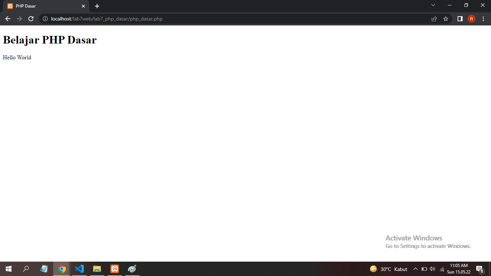

## 5 Variable PHP
Menambahkan variable pada program.
```php
<?php
    $nim = "0411500400";
    $nama = 'Abdullah';
    echo "NIM : " . $nim . "<br>";
    echo "Nama : $nama";
?>
```
Kemudia untuk hasilnya akan seperti berikut.
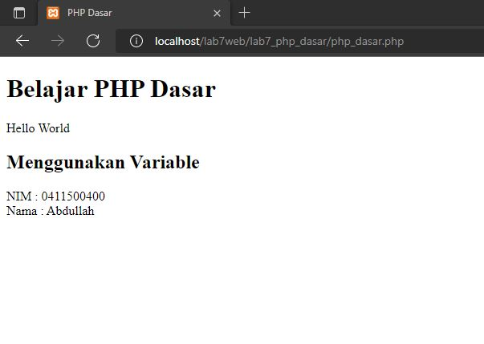
## 6. Predifine Variable $_GET
Buatlah file baru dengan nama latihan2.php didalam directory `lab7_php_dasar`

Kemudian tambahkan kode seperti berikut.
```php
<!DOCTYPE html>
<html lang="en">
<head>
    <meta charset="UTF-8">
    <meta http-equiv="X-UA-Compatible" content="IE=edge">
    <meta name="viewport" content="width=device-width, initial-scale=1.0">
    <title>Predifine Variable</title>
</head>
<body>
    <h2>Predifine Variable</h2>
    <?php
        echo 'Selamat Datang ' . $_GET['nama'];
    ?>
</body>
</html>
```

* Untuk mengaksesnya gunakan URL:
http://localhost/lab7_php_dasar/latihan2.php?nama=rangga 

hasilnya akan seperti ini
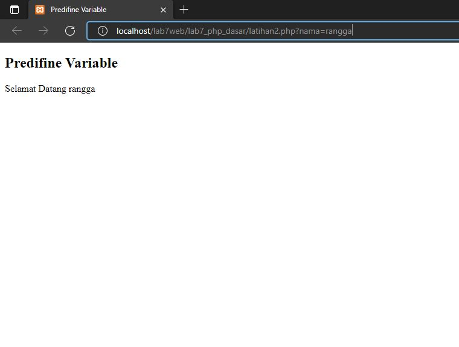

## 7. Membuat Form Input
Buatlah file baru dengan nama latihan3.php didalam directory lab7_php_dasar

Kemudian tambahkan kode seperti berikut.
```html
<!DOCTYPE html>
<html lang="en">
<head>
    <meta charset="UTF-8">
    <meta http-equiv="X-UA-Compatible" content="IE=edge">
    <meta name="viewport" content="width=device-width, initial-scale=1.0">
    <title>PHP Dasar</title>
</head>
<body>
<h2>Form Input</h2>
<form method="post">
    <label>Nama: </label>
    <input type="text" name="nama">
    <input type="submit" value="Kirim">
</form>
<?php
echo 'Selamat Datang ' . $_POST['nama'];
?>
</body>
</html>
```
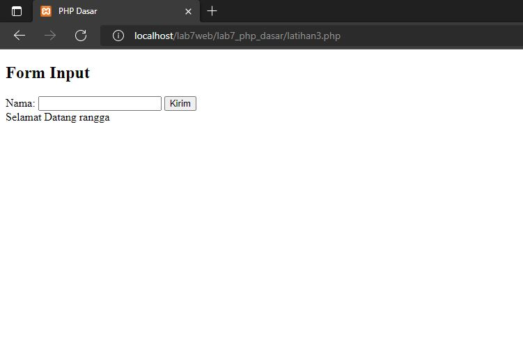

## 8. Operator
Buatlah file baru dengan nama latihan4.php didalam directory lab7_php_dasar
Tambahkan kode seperti berikut.
```php
<!DOCTYPE html>
<html lang="en">
<head>
    <meta charset="UTF-8">
    <meta http-equiv="X-UA-Compatible" content="IE=edge">
    <meta name="viewport" content="width=device-width, initial-scale=1.0">
    <title>Operator</title>
</head>
<body>
    <h2>Operator</h2>
    <?php
        $gaji = 1000000;
        $pajak = 0.1;
        $thp = $gaji - ($gaji*$pajak);
        echo "Gaji sebelum pajak = Rp. $gaji <br>";
        echo "Gaji yang dibawa pulang = Rp. $thp";
    ?>
</body>
</html>
```
Hasilnya akan seperti berikut.
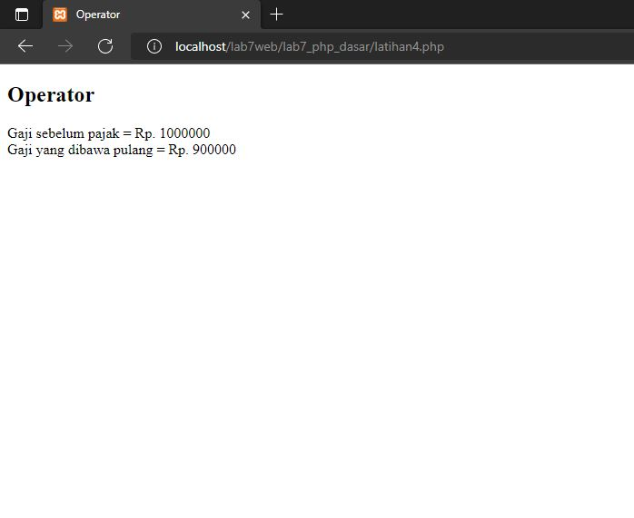

## 9 Kondisi IF
Buatlah file baru dengan nama latihan5.php didalam directory lab7_php_dasar
Tambahkan kode seperti berikut.
```php
<!DOCTYPE html>
<html lang="en">
<head>
    <meta charset="UTF-8">
    <meta http-equiv="X-UA-Compatible" content="IE=edge">
    <meta name="viewport" content="width=device-width, initial-scale=1.0">
    <title>IF & Switch</title>
</head>
<body>
    <h2>Kondisi IF</h2>
    <?php
        $nama_hari = date("l");
        if ($nama_hari == "Sunday") {
            echo "Minggu";
        } elseif ($nama_hari == "Monday") {
            echo "Senin";
        } else {
            echo "Selasa";
        }
    ?>
</body>
</html>
```
hasilnya akan seperti berikut
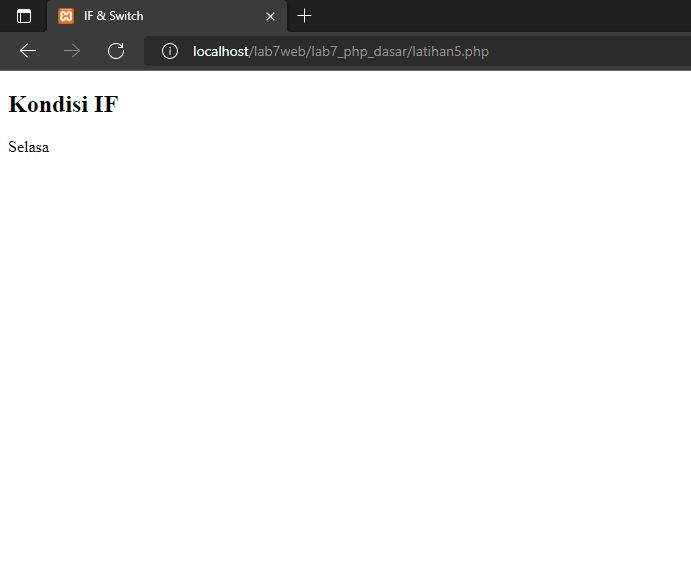
## 10. Kondisi Switch
Tambahkan kode seperti berikut.
```php
<h2>Kondisi Switch</h2>
<?php
$nama_hari = date("l");
switch ($nama_hari) {
    case "Sunday":
        echo "Minggu";
        break;
    case "Monday":
        echo "Senin";
        break;
    case "Tuesday":
        echo "Selasa";
        break;
    default:
        echo "Sabtu";
}
?>
```
Hasilnya akan seperti berikut.
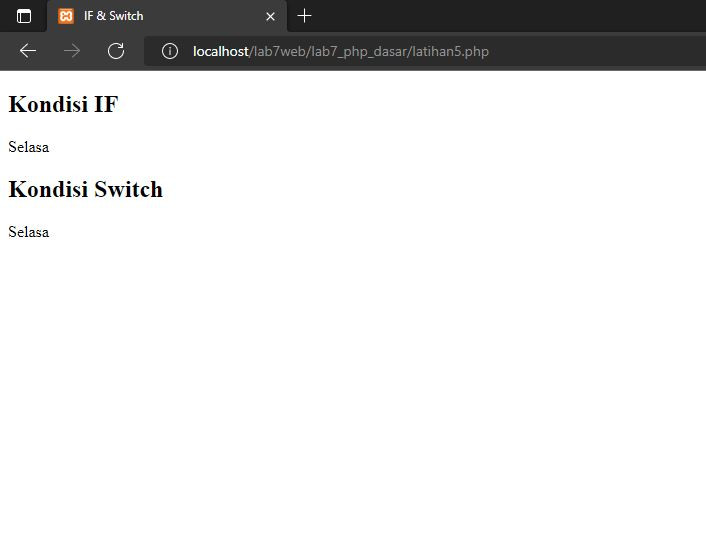

## 11. Perulangan
### 1. Perulangan for

Buatlah file baru dengan nama latihan6.php didalam directory lab7_php_dasar
Tambahkan kode seperti berikut.
```php
<!DOCTYPE html>
<html lang="en">
<head>
    <meta charset="UTF-8">
    <meta http-equiv="X-UA-Compatible" content="IE=edge">
    <meta name="viewport" content="width=device-width, initial-scale=1.0">
    <title>Perulangan</title>
</head>
<body>
    <h2>Perulangan for</h2>
    <?php
    echo "Perulangan 1 sampai 10 <br />";
    for ($i=1; $i<=10; $i++) {
        echo "Perulangan ke: " . $i . '<br />';
    }
    
    echo "Perulangan Menurun dari 10 ke 1 <br />";
    for ($i=10; $i>=1; $i--) {
        echo "Perulangan ke: " . $i . '<br />';
    }
    ?>
</body>
</html>
```
Maka hasilnya akan seperti berikut.
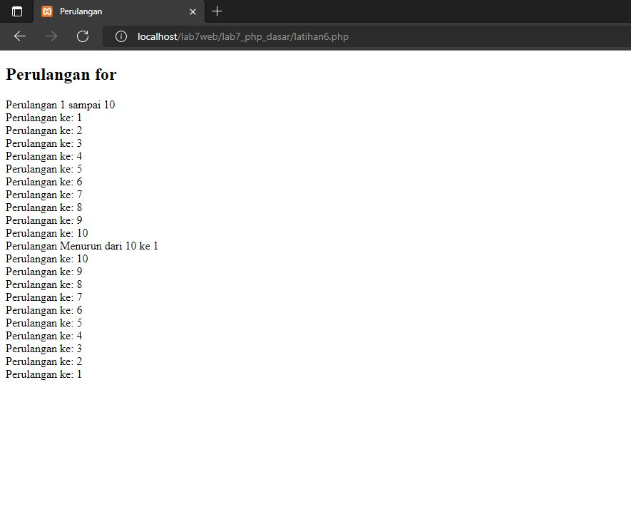

## 2. Perulangan while
Tambahkan kode seperti berikut.
```php
<?php
echo "Perulangan 1 sampai 10 <br />";
$i=1;
while ($i<=10) {
    echo "Perulangan ke: " . $i . '<br />';
    $i++;
}
?>
```
Maka hasilnya akan seperti ini
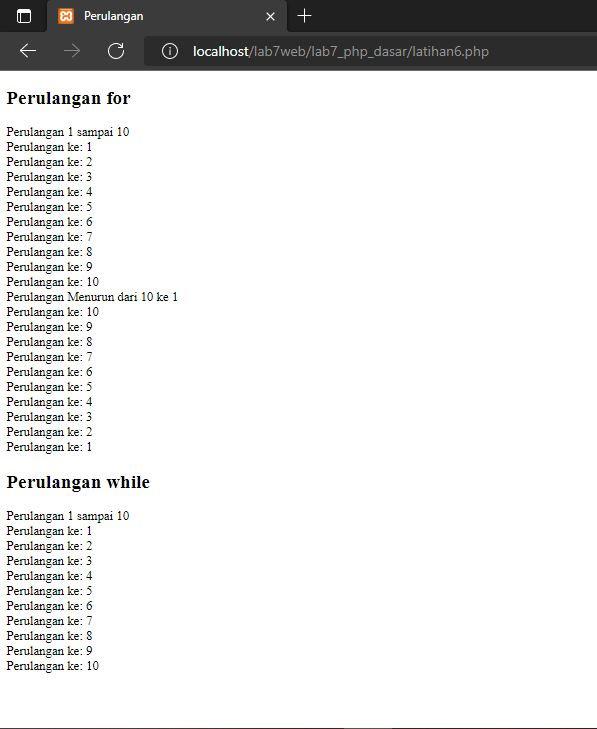

## 3. Perulangan dowhile
Tambahkan kode seperti berikut.
```php
<?php
echo "Perulangan 1 sampai 10 <br />";
$i=1;
do {
    echo "Perulangan ke: " . $i . '<br />';
    $i++;
} while ($i<=10);
?>
```
Maka hasilnya akan seperti berikut
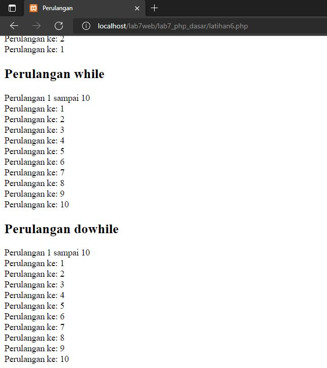

# Pertanyaan dan Tugas
Buatlah program PHP sederhana dengan menggunakan form input yang menampilkan nama, tanggal lahir dan pekerjaan. Kemudian tampilkan outputnya dengan menghitung umur berdasarkan inputan tanggal lahir. Dan pilihan pekerjaan dengan gaji yang berbeda-beda sesuai pilihan pekerjaan.

## Jawab

kodenya seperti berikut.
```php
<!DOCTYPE html>
<html lang="en">
<head>
    <meta charset="UTF-8">
    <meta http-equiv="X-UA-Compatible" content="IE=edge">
    <meta name="viewport" content="width=device-width, initial-scale=1.0">
    <title>Form</title>
</head>
<body>
   <h2>FORM</h2>
    <form method="post" >
            <label>Nama: </label><br>
            <input type="text" name="nama"><br>
            <label>Tanggal Lahir: </label><br>
            <input type="date" name="tgl"><br>
            <label>Pekerjaan: </label><br>
            <select name='pekerjaan'>
                <option value="">~Pilih Pekerjaan~</option>
                <option value="Android Developer">Android Developer</option>
                <option value="System Analyst">System Analyst</option>
                <option value="Web Designer">Web Designer</option>
                <option value="Fullstack Developer">Fullstack Developer</option>
            </select><br><br>
            <button type="submit">Kirim</button>
    </form>
    <h2>HASIL</h2>
    <?php
        # Nama
        echo 'Nama: ' . $_POST['nama'];
        # Merubah Tanggal Lahir menjadi Umur
        $tgl = $_POST['tgl'];
        $lahir = new DateTime($tgl);
        $hari_ini = new DateTime();
        $diff = $hari_ini->diff($lahir);
        echo "<br> Umur: ". $diff->y ." Tahun";
        # Memanggil pekerjaan
        echo "<br> Pekerjaan: ". $_POST['pekerjaan'];
        # gaji
        $pekerjaan = $_POST['pekerjaan'];
        if($pekerjaan == "Android Developer"){
            echo '<br> Gaji: Rp. 40 juta';
        }elseif($pekerjaan == "System Analyst"){
            echo '<br> Gaji: Rp. 25 juta';
        }elseif($pekerjaan == "Web Designer"){
            echo '<br> Gaji: Rp. 28 juta';
        }elseif($pekerjaan == "Fullstack Developer"){
            echo '<br> Gaji: Rp. 45 juta';
        }
    ?>
  </body>
</html>
```
Maka hasilnya akan berikut.
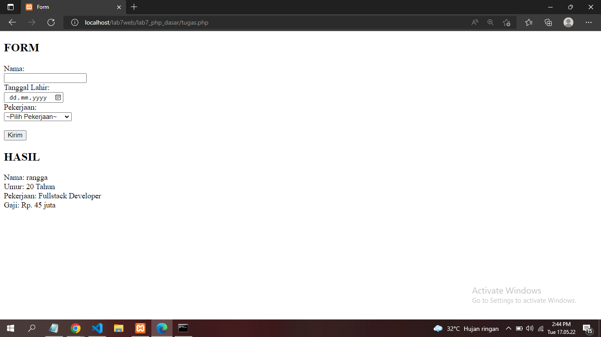